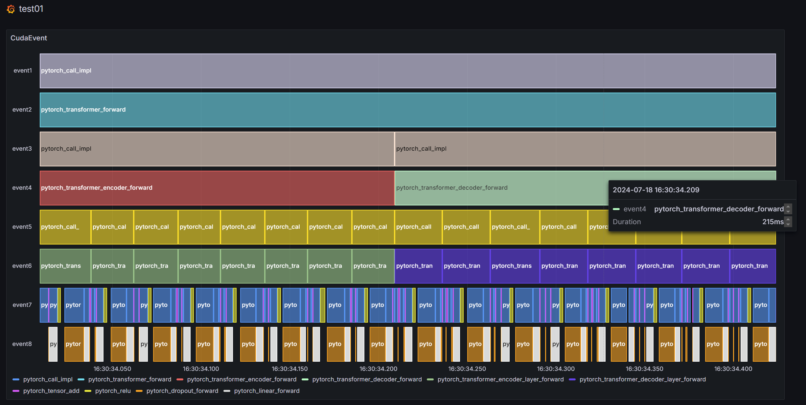

# GRAFANA TIMELINE

自动读取log文件，将数据插入数据库，以便 grafana 绘制 timeline 图

grafana 示范链接 http://192.168.134.104:3000/public-dashboards/d0999cf577c14e279f0c5ef494b9bd72

## 运行示范

```bash
python insert_data.py --ip ${db-ip} --port ${db_port} --user ${db-username} --pwd ${db-password} --table ${db-table} --log_file ${path-to-log-file}
```
log file 的格式参考 `log/transformer.log`

## 效果

